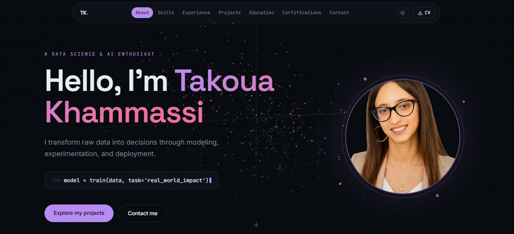

# ✨ Takoua Khammassi — Data Scientist Portfolio

A dark, data-driven portfolio built to feel like the tools I work with every day —
scatter plots, model metrics, and terminal-style interactions — rather than a
generic template.

🔗 **[Live demo](https://ds-portfolio-tonpseudo.vercel.app)**



## Highlights

- 🧠 **3D embedding-space hero** — an animated, mouse-interactive point cloud
  (Three.js) styled like a t-SNE/PCA projection, not a generic particle effect
- 🌗 **Light/dark mode** with a fully theme-reactive palette
- 🎥 **AI-generated talking avatar** in the hero, with real-time background
  removal (canvas-based chroma key)
- 📄 **Interactive certifications** — click to preview and download the PDF
- 💼 **Project detail modals** with live demo, source code, and key metrics
- 📬 **Working contact form** — real emails via Web3Forms, no backend

## Stack

React · Vite · Tailwind CSS v4 · Framer Motion · Three.js · Web3Forms

## Run locally

```bash
npm install
npm run dev
```

All content (bio, skills, projects, certifications) lives in a single file:
`src/data/content.js` — no need to touch components to update the text.

---

Built by [Takoua Khammassi](https://ds-portfolio-tonpseudo.vercel.app) · feel free to fork and adapt for your own portfolio.